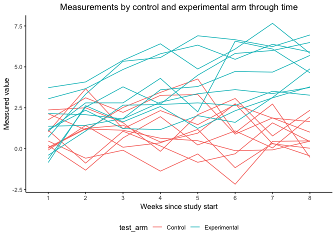
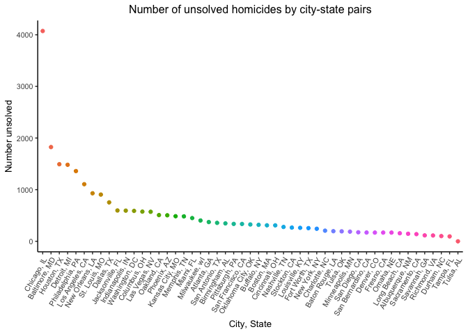

Homework 5
================
Christian Pascual
11/1/2018

Libraries and settings
======================

``` r
library(tidyverse)


knitr::opts_chunk$set(
  out.width = "90%"
)

theme_set(theme_classic() + 
            theme(legend.position = "bottom", 
                  plot.title = element_text(hjust = 0.5))
          )
```

tidyverse helps with the analysis, and we've changed some settings to make sure plots format nicely.

Problem 1
=========

This problem wants to assemble data from a directory of files into a tidy dataset using iteration. We'll start with a tibble below, starting with all the file names.

``` r
pt_data = tibble(
  filenames = list.files(path = './data')
  )
```

According to the files, there are 10 patients in the control arm and 10 in the experimental arm. With these file names, we can iterate through them and store the data associated with each file into its own column. From there, we can properly tidy the dataset.

``` r
# function to map over the file names
grab_data = function(filename) {
  data_dir = './data/'
  data = read.csv(paste(data_dir, filename, sep = ""))
  return(data)
}

tidy_pt_data = pt_data %>% 
  mutate(data = map(filenames, grab_data)) %>% 
  unnest(data) %>% # unleash the data
  mutate(subject_id = str_replace(filenames, ".csv", ""),
         test_arm = ifelse(grepl("con", subject_id), "Control", "Experimental")
         ) %>% 
  gather(., key = week, value = meas, week_1:week_8) %>% 
  separate(., week, into = c("remove", "week_number"), sep = "_") %>% 
  select(everything(), -remove, -filenames)
```

We've used `map()` to read each subject's data into a corresponding column and unnested it to reveal their measurements. After some renaming and gathering, the data is now in tidy form.

Now we can plot out the data for each subject by experimental arm.

``` r
ggplot(tidy_pt_data, aes(x = week_number, y = meas, 
                         group = subject_id, color = test_arm)) +
  geom_line() +
  labs(
    title = "Measurements by control and experimental arm through time",
    x = "Weeks since study start",
    y = "Measured value"
  )
```

    ## Warning: Removed 417432 rows containing missing values (geom_path).



The plot demonstrates that there is a clear difference in measurements between the control and experimental arms at the end of 8 weeks. At week 1, both arms are at approximately the same level, but through time, the experimental arm sees an increase that the control arm does not.

Problem 2
=========

This problem deals with homicide data made available by the Washington Post.

``` r
homicides = read.csv(file = "./data/homicide-data.csv") %>% 
  mutate(city_state = paste(city, state, sep = ", "))
```

The `homicides` data has 52179 rows and 13 columns. Each row consists of an ID, victim details, homicide location details, and the resulting disposition of the case.

We'll create a summary of the case dispositions below by city.

``` r
homicide_summary = homicides %>% 
  group_by(city_state) %>% 
  summarize(n_homicides = n(),
            n_unsolved = sum(disposition == "Closed without arrest" | 
                                         disposition == "Open/No arrest"))

ggplot(homicide_summary, aes(x = reorder(city_state, -n_unsolved), 
                             y = n_unsolved, 
                             color = reorder(city_state, -n_unsolved))) +
  geom_point() +
  labs(
    title = "Number of unsolved homicides by city-state pairs",
    x = "City, State",
    y = "Number unsolved"
  ) +
  theme(legend.position = "none", 
        axis.text.x = element_text(angle = 60, hjust = 1),
        text = element_text(size = 10))
```



Homicide in Baltimore, MD
=========================

We'll have a look at the proportion of unsolved homicides in Baltimore, Maryland before expanding statistical analyses to all cities.

``` r
baltimore = homicide_summary %>% 
  filter(., city_state == "Baltimore, MD")

baltimore_prop_test = prop.test(baltimore$n_unsolved, baltimore$n_homicides)
prop_tibble = broom::tidy(baltimore_prop_test)
```

The true proportion of unsolved homicide cases in Baltimore, MD is between 0.6275625 and 0.6631599 with 95% confidence. With this workflow in mind, we can expand it to the rest of the cities.

``` r
homicide_summary_with_stats = homicide_summary %>% 
  mutate(prop_test = map2(.x = n_unsolved, .y = n_homicides, 
                          function(x, y) prop.test(x, y)),
         stats = map(prop_test, broom::tidy)) %>% 
  unnest(stats) %>% 
  select(city_state, estimate, conf.low, conf.high)
```

    ## Warning in prop.test(x, y): Chi-squared approximation may be incorrect
